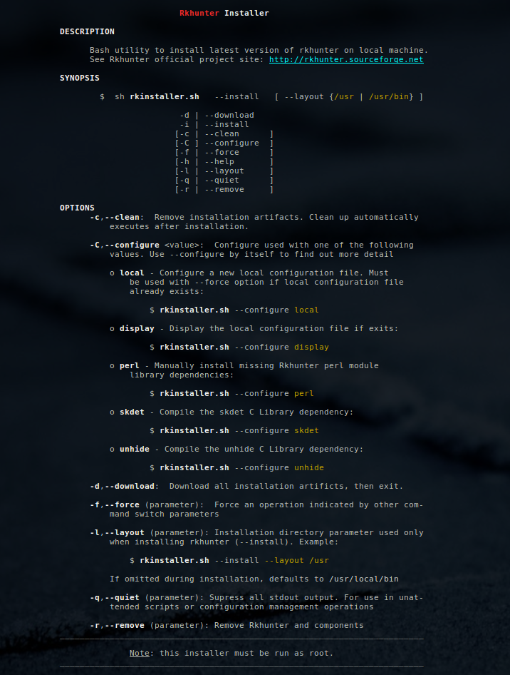
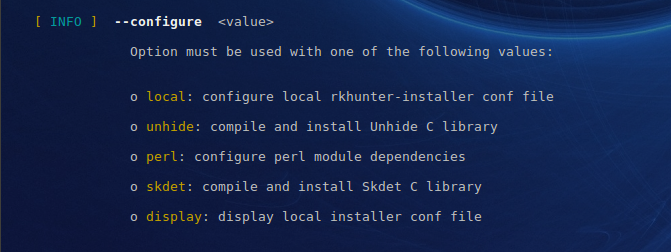

<a name="top"></a>
* * *
# Rkhunter Installer
* * *

## Summary

Utility for installing and configuring the latest version of [Rkhunter Malware Scanner](https://en.wikipedia.org/wiki/Rkhunter) for linux.

Rkhunter Installer, version **1.7**

* * *

## Contents

* [Getting Started](#getting-started)
* [Scope](#scope)
* [Dependencies](#dependencies)
* [Instructions](#instructions)
* [Help](#help)
* [Author & Copyright](#author--copyright)
* [License](#license)
* [Disclaimer](#disclaimer)


* * *

## Getting Started

See the following resources before getting started:

- Rkhunter [Project Site](http://rkhunter.sourceforge.net/) on Sourceforge
- Rkhunter Official [README](https://sourceforge.net/p/rkhunter/rkh_code/ci/master/tree/files/README)

[back to the top](#top)

* * *

## Scope

rkhunter-install will perform the following on your system to satisfy Rkhunter dependencies:

* **Perl Modules**:  
    - Installation of `cpan` if required
    - Installation of Perl module dependencies that rkhunter uses for malware or other checks

* **C Library**: `unhide`
    - required for discovery of hidden processes
    - compiles, installs

* **C Library**: `skdet`
    - required for specialized rootkit detection
    - compiles, installs

* **Uninstall Utility**
    - Installs uninstall utility in local config directory should you ever need to remove Rkhunter

* **Configuration File**
    - generates local configuration file required for uninstall


[back to the top](#top)

* * *

## Dependencies

* Ubuntu, Ubuntu variants, 14.04
* Ubuntu, Ubuntu variants, 16.04+
* Redhat, Centos v7.0+
* [Amazon Linux](https://aws.amazon.com/amazon-linux-ami) 2017+

[back to the top](#top)

* * *

## Instructions

Run the installer from the cli via the following command:

```bash
    $ sudo sh rkhunter-install.sh
```

Installation directory is set using the `--layout` parameter:

```bash

    $ sudo sh rkhunter-install.sh --layout /usr    

        # install directory /usr/bin

```

If the `--layout` parameter is not provided, the following is assumed:

```bash

    $ sudo sh rkhunter-install.sh --layout "default"    

        # install directory /usr/local/bin

```

**NOTE**:
* Root privileges (sudo) must be used or run the installer directly as root
* The installer performs an integrity check using sha256 on all files it
retrieves.  The installation will only proceed if integrity check passes.

[back to the top](#top)

* * *

## Help

To display the help menu:

```bash
    $ sh rkhunter-install.sh --help
```

[](https://rawgithub.com/fstab50/gensec/master/rkhunter/assets/help-menu.png)


To display help menu for the `--configure` option:

```bash
    $ sh rkhunter-install.sh --configure
```

[](https://rawgithub.com/fstab50/gensec/master/rkhunter/assets/help-configure.png)


[back to the top](#top)

* * *

## Author & Copyright

All works contained herein copyrighted via below author unless work is explicitly noted by an alternate author.

* Copyright Blake Huber, All Rights Reserved.

[back to the top](#top)

* * *

## License

* Software contained in this repo is licensed under the [license agreement](./LICENSE.md).

[back to the top](#top)

* * *

## Disclaimer

*Code is provided "as is". No liability is assumed by either the code's originating author nor this repo's owner for their use at AWS or any other facility. Furthermore, running function code at AWS may incur monetary charges; in some cases, charges may be substantial. Charges are the sole responsibility of the account holder executing code obtained from this library.*

Additional terms may be found in the complete [license agreement](./LICENSE.md).

[back to the top](#top)

* * *
